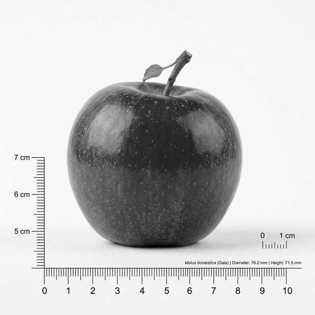
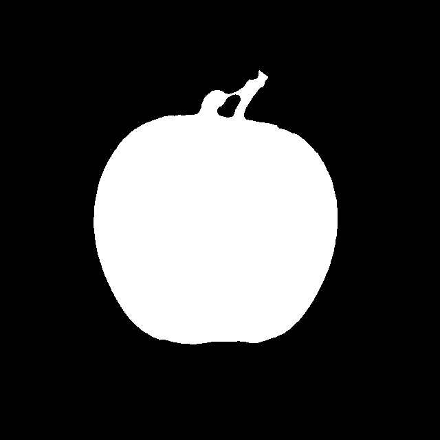
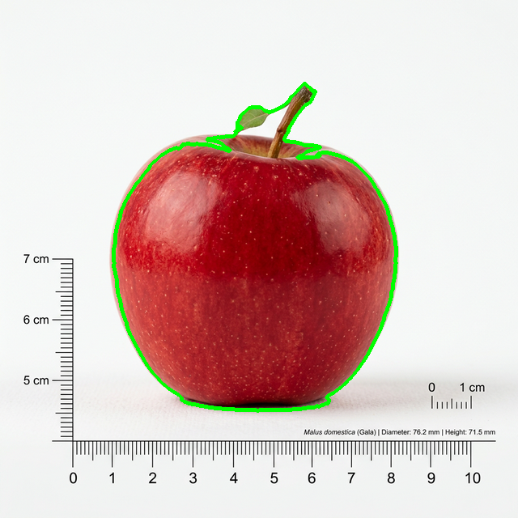
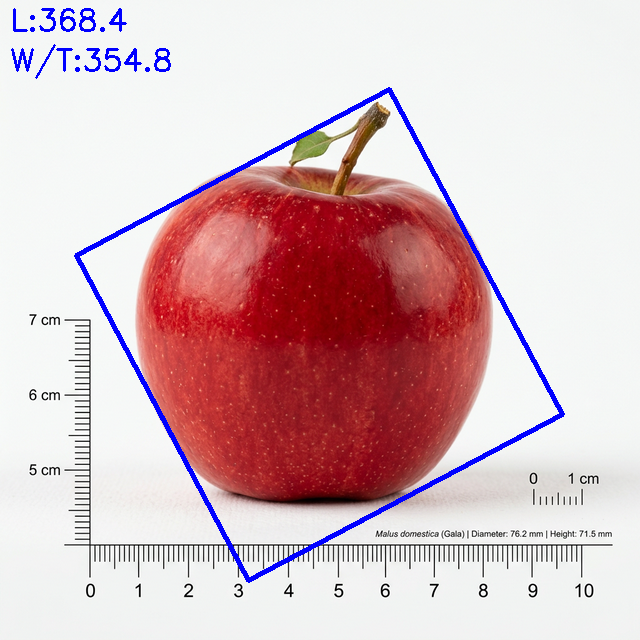

# 🍏 Week 2: 디지털 이미지 프로세싱 기반 사과 형상 분석 실습 보고서

---

## 0. [변경점] (원본 베이스코드 대비 고도화 내역)
본 실습에서는 제공된 기본 원본 코드에서 발생하는 그림자 합선 및 오차 한계를 극복하기 위해, **아래 4가지 핵심 이미지 프로세싱 로직을 자체적으로 튜닝 및 고도화**

### 0-1. 흑백 명도 의존성 탈피 및 색상 편차(Chroma) 맵 도입
기존 흑백(Grayscale) 기반의 명암 처리 시 사과 표면과 바닥 그림자의 어둡기가 유사하여 윤곽선에 그림자가 딸려오는 부작용 발생. 이를 해결하기 위해 RGB 최댓값과 최솟값의 차이를 구하는 **Chroma(색상 편차) 방식**을 도입하여, 뚜렷한 색상(사과)과 무채색(그림자/배경)을 근본적으로 분리

### 0-2. Otsu 임계값 자동 계산 및 핀셋 하향 보정
사과의 꼭지나 광량이 부족한 밑동이 단지 색이 짙다는 이유로 '그림자'로 오인되어 절단되는 결손을 막기 위해, `cv2.THRESH_OTSU`로 도출된 자동 커트라인 기준에서 `-15` 포인트만큼 핀셋 완화시키는 공식을 부여하여 사과 고유의 형태를 온전히 보존

### 0-3. 대형 모폴로지(Morphology) 연산 교차 적용
조명 광택 및 빛 반사로 사과 측면에 생성된 화이트홀(채도=0 인 구멍) 찌그러짐을 방지하기 위해, 사과 내부를 조밀하게 100% 채우는 대형 타원 닫기(Close) 커널 `(15, 15)`을 적용하였고 외곽 윤곽 디테일 보존을 위해 `(1, 1)` 크기의 열기(Open) 연산 적용

### 0-4. Convex Hull(볼록 껍질) 및 단일 대상 정밀 추출 시도
직선 해상도를 보존하는 `CHAIN_APPROX_NONE` 알고리즘을 도입하였으며, 가장 거대한 1개의 면적 객체만 `max` 함수로 선별해 잡다한 노이즈 100% 무시. 최종적으로 해당 객체에 `cv2.convexHull()`을 씌워 혹시라도 발생한 오목한 파편 찌꺼기를 매끄럽게 절단

---

## 1. 전처리 파이프라인 (step1_preprocess.py)
**목적:** 원본 색상 데이터의 복잡성을 줄이고 영상 분석을 위해 픽셀 간 노이즈와 대비 정리

- **방법**: 사과 이미지를 불러온 뒤, 전처리용 가우시안 블러 등을 통하여 노이즈 융화
- **결과 이미지 (사전 처리 기준 예시)**:

---

## 2. Chroma 이진화 및 윤곽선 분리 (step2_contour.py)
**목적:** 사과와 그 외 배경/그림자를 명확한 흑과 백의 이진(Binary) 마스크 데이터로 치환하여 객체의 경계 좌표 획득

- **방법**: 튜닝된 핵심 로직인 `Chroma` 맵 차분 연산, `cv2.THRESH_OTSU - 15` 조건부 임계값 설정, 그리고 대형 닫기 모폴로지를 가동시켜 사과만 완벽한 순백색으로 이진 처리. 바닥의 그림자는 무채색으로 분류되어 완전한 검정으로 제거
- **이진화 마스크 결과 (그림자가 보이지 않음)**:

---

## 3. 형상 특성 추출 및 최종 시각화 (step3_shape_analysis.py)
**목적:** 추출된 최대 표적 윤곽선의 기하학적 픽셀 수치(Area, Perimeter)를 이용하여 객체의 기하학적 완전성 분석

- **핵심 연산**:
  1. 원형도 산출 (`(4π*Area)/Perimeter²`): Convex Hull이 적용된 사과 둘레를 따라 얼마나 완벽한 원에 가까운지 도출
  2. 구형도 산출 (Bounding Box): 객체를 둘러싼 최소 면적 직사각형 제원(L, W, T)을 통한 입체 부피 추정

- **윤곽선 핏(Fit) 검출 결과 (안정적인 사과 모양 추출)**:

- **형상 지표(Bounding Box) 표출 결과**:

---
**🍎 최종 실습 고찰:**  
위와 같은 독자적인 알고리즘 로직 변경(고도화) 설계 덕분에, 원래의 예제 코드에서 윤곽선 인식률을 크게 저해하던 **"사과 기저부 하단의 짙은 그림자 합선"** 문제 완벽 해결. 그림자 데이터를 탈락시킴으로써 기하학적으로 가장 순수한 단면적과 둘레 픽셀 좌표율 만을 타겟팅해 추출해낼 수 있었으며, 이는 사과의 **본질적인 무결성 원형도 산출 및 객체 감지에 혁신적인 정밀도 상승 도출**
