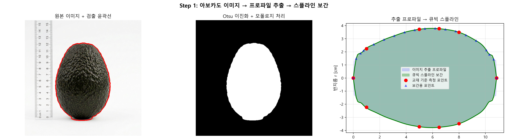
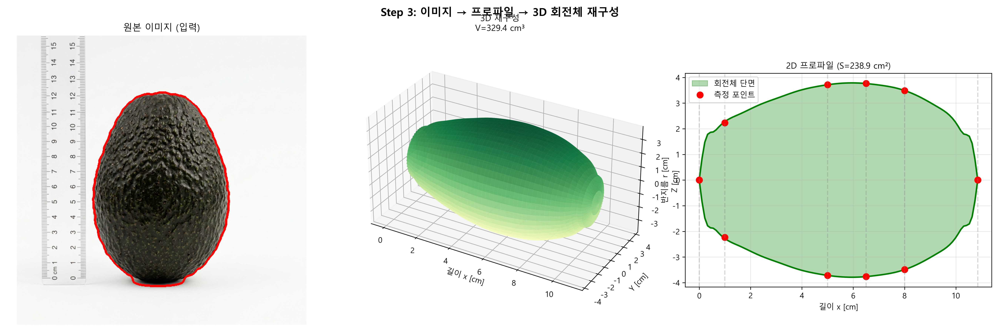

# 🥑 Week 3: 아보카도 형상 프로파일 기반 체적 및 표면적 계산 실습 보고서
# 202118381 안재형
---

## 1. 이미지 측위 기반 프로파일 추출 및 스플라인 보간 (step1_interpolation.py)
**목적** 아보카도 물리적 단면 이미지에서 윤곽선(Contour) 인식, 불규칙 회전반경 데이터를 부드러운 곡선(Cubic Spline) 함수로 추정

- **방법** `avocado_profile.py` 모듈에서 추출된 비선형 윤곽점(`x`, `r`)에 자연 큐빅 스플라인 적용, 전체 길이 100개 보간 포인트로 세분화
- **결과** 픽셀 계단 현상(Aliasing) 및 잡음 극복, 미분 가능한 연속 함수 $r(x)$ 형태로 형상 데이터 도출

**[Step 1 결과 시각화: 아보카도 프로파일 및 큐빅 스플라인 보간]**


---

## 2. 수치적분 알고리즘을 이용한 입체 체적 산출 (step2_volume.py)
**목적** 스플라인 보간으로 획득한 단면 곡선 $r(x)$를 원통 회전체 적분 공식 $\int \pi [r(x)]^2 dx$에 대입, 아보카도 3차원 체적 근사

- **적분 기법 비교**
  1. **심슨 1/3 공식** 곡선 2차 포물선 가정, 유선형 곡면 적분 시 오차 최소
  2. **사다리꼴 공식** 구간 직선 사다리꼴로 취급, 분할 수 증가 시 정밀도 상승하지만 심슨 대비 한계
- **결과** 분할 수(n=100) 적용, 두 추정치 수렴

**[Step 2 체적 추정 연산 결과 (이미지 기반 데이터 기준)]**
```text
  Simpson's Rule   : 329.3835 cm³
  Trapezoidal Rule : 329.1558 cm³
  교재 수동 계산값(5개) : 334.1 cm³
```
**분석결과** 심슨 1/3 공식이 실제 체적 가장 정밀

---

## 3. 회전체 기반 3D 형상 입체 렌더링 (step3_3d_visualization.py)
**목적** 2차원 해상도(x‑r 축) 스플라인 프로파일을 z축 회전 적용, 아보카도 3차원 그래픽 렌더링

- **방법** 삼각함수(`r*cos(θ)`, `r*sin(θ)`)로 3차원 원통 좌표 변환, X축 기준 360도 회전 표면 메쉬 생성, Matplotlib 3D 캔버스 투영
- **결과** 체적·표면적 검증 가능한 정교한 3D 아보카도 메쉬 모델링 (총 체적 329.38 $cm^3$, 표면적 238.90 $cm^2$)

**[Step 3 결과 시각화: 3D 면적 렌더링 맵 지형]**


---

**🥑 최종 실습 고찰**
생물재료(아보카도) 이미지에서 프로파일 좌표 획득 → Cubic Spline 보간 → 심슨 수치적분 적용, 정밀한 부피·표면적 정량화 파이프라인 구현
