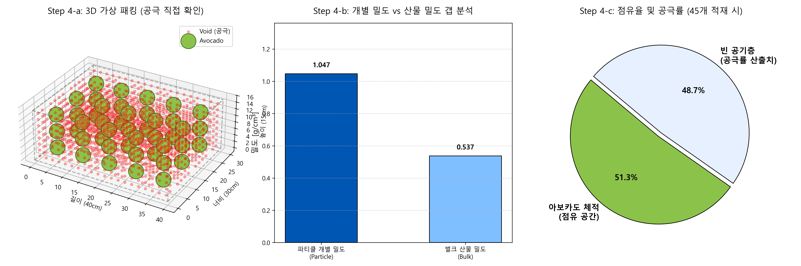
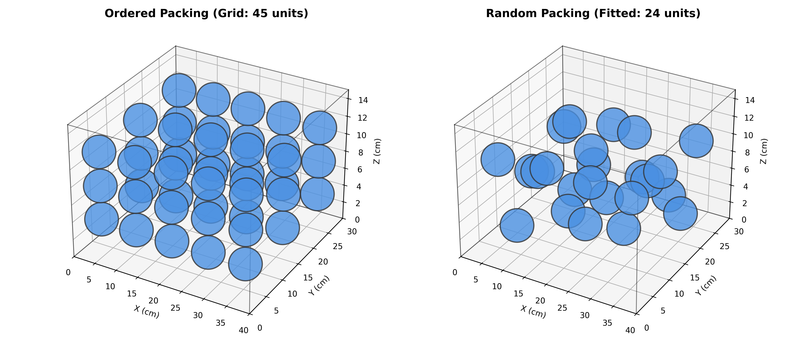

# 🥑 Week 4: 농산물 밀도 및 공극률(Porosity) 산출 실습 보고서
# 202118381 안재형
---

## 1. 개별 객체 밀도 및 산물 밀도 계산 (step1_density_porosity.py)
**목적** 아보카도 개별 체적·질량 기반 파티클 밀도(Particle Density) 산출, 적재 시 산물 밀도(Bulk Density) 차이를 통한 공극률(Porosity) 정량화

- **방법** 3주차 도출 체적 데이터(205.4 cm³) 및 가상 질량(215g) 적용, 박스 규격(40x30x15) 내 45개 적재 시 밀도 이론치 연산
- **결과** 
  - **파티클 Density**: 1.047 g/cm³ (침강성 확인), **벌크 Density**: 0.537 g/cm³
  - **최종 공극률**: **48.65%** (밀도·체적 기반 두 수식 수렴 확인)
- **분석** 아보카도 밀도가 물(1.0)보다 높아 선별 시 침강 현상 발생 예상, 박스 내 약 48% 공기층 형성에 따른 호흡열 대류 통로 기능 규명

**[Step 1 결과 시각화: 3D 패킹 및 밀도/공극 분석]**

---

## 2. 가변 밀도 적용 및 고급 적재 분석 (step2_advanced_apple.py)
**목적** 사과 품종별 가변 밀도 데이터 적용, 생물자원 물성 변화에 따른 공극률 상관관계 분석

- **방법** 아보카도 대비 저밀도·고체적 특성(사과) 대입, 입자 밀도 변화에 따른 벌크 밀도 및 공극률 변동 추계
- **결과** 파티클 밀도 0.889 g/cm³, 공극률 **58.00%** 도출 (아보카도 대비 약 10% 상승)
- **분석** 단위 질량당 체적이 큰 작물일수록 적재 점유율 하락 및 공극률 상승 지표 확인

---

## 3. 가상 패킹 시뮬레이션 비교 (step3_random_packing.py)
**목적** 이상적 배열(Ordered)과 실제 무작위(Random) 적재 간 공간 효율 시뮬레이션, 벌크 밀도 저하 원인 규명

- **방법** 몬테카를로 난수 및 `cdist` 충돌 감지 로직 적용, 무작위 적재 시의 공간 점유 한계 확인
- **결과** 
  - **배열 적재**: 45/45개 (100% 효율), **무작위 적재**: 24/45개 (53.3% 효율)
- **분석** 무작위 적재 시 발생하는 '공간 파편화(Space Fragmentation)'로 인한 가용 공간 소멸 확인, 실무적 적재 손실(약 46.7%) 실증

**[Step 3 결과 시각화: 배열 적재 vs 무작위 적재 시뮬레이션]**

---

**🥑 최종 실습 고찰**
개별 밀도(Particle)와 집단 밀도(Bulk) 상관관계 규명을 통한 공극률 산출 파이프라인 구축, 적재 패턴(Packing Pattern)에 따른 공간 효율 임계치 시뮬레이션 및 물류적 시사점 도출
