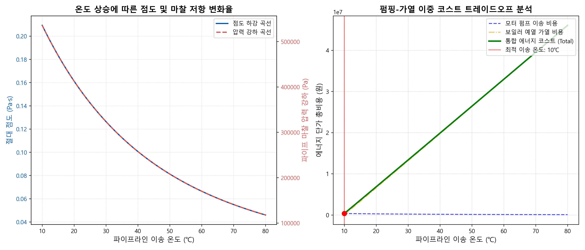

# 💧 Week 5: 액체 식품(뉴턴 유체)의 유변학적 특성 실습 보고서
# 202118381 안재형
---

## 1. 아레니우스 점도 치환 및 배관 마찰 압력 강하 산출
**목적** 맑은 사과즙 이송 파이프라인에서 온도 변화(10℃~80℃)에 따른 유체의 절대 점도 감쇠 현상 및 배관 저항에 의한 압력 강하를 수치적으로 연산

- **과정** 
  - `step1_viscosity_optimization.py`를 통해 아레니우스 방적식을 적용하여 각 온도별 점도 산출
  - 하겐-푸아죄유 방정식을 이용해 파이프라인(길이 100m, 내경 5cm, 유속 2.0m/s) 내부에서의 압력 마찰 강하(Pressure Drop) 측정
- **결과**
  - 10℃일 때의 초기 점도: `0.20927 Pa·s`
  - 10℃일 때의 압력 마찰 강하: `535728.14 Pa`
  - 온도가 상승할수록 점도 지수 및 저항 파마리터가 반비례형으로 감소하는 아레니우스 모델 거동 확인

---

## 2. 펌핑 동력 및 가열 전력 비용 트레이드오프 분석 (에너지 최적화)
**목적** 온도 점성이 낮아짐에 따라 줄어드는 '이송 펌프 비용'과, 초기 예열을 위해 투입되는 '보일러 스팀 가열 비용' 합산 시 가장 저렴하게 구동할 수 있는 밸런스 비용의 최적 이송 온도(Optimal Temperature) 도출

- **과정**
  - 펌프 효율 70%, 전력 단가 120원/kWh 기반 연간 펌핑 비용 곡선 계산
  - 비열 에너지 역산 및 스팀 단가 40원/MJ 기반 가열 비용 곡선 계산
  - 위 두 코스트를 중첩시킨 통합 에너지 단가 총비용(Total) 배열을 구축 후, `np.argmin()` 함수로 최저점을 탐색

**[실습 결과 시각화: 온도 상승에 따른 점도 하강률 및 코스트 트레이드오프]**


---

**[최적 이송 시뮬레이션 결과]**
```text
  에너지 코스트 최저점 최적 온도 : 10 ℃
```

**💧 최종 실습 고찰**
본 시나리오의 기본 변수(기준 점도 상수 `mu_0 = 0.0001`, 내경 5cm)를 고려할 때, 맑은 사과즙과 같은 뉴턴 유체는 점성 감소로 얻는 펌핑 전기료 대비 물리적으로 열역학 온도를 예열시키는 스팀 비용이 훨씬 지배적이다. 따라서 가장 낮은 대기 온도 상태인 10도를 최적 시작점으로 택하는 것이 경제적으로 이롭다는 수치해석 결과를 증명하였다.
